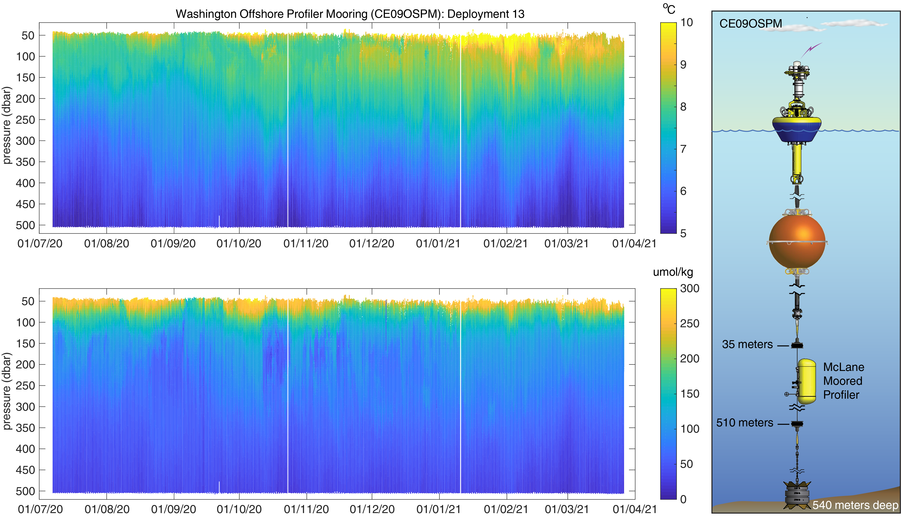
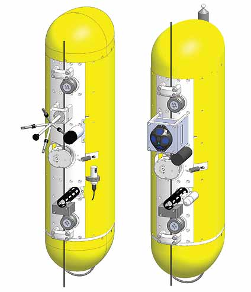

# mmp_toolbox: A MATLAB® toolbox for processing ocean data collected by McLane Moored Profilers

**Figure 1:** Washington Offshore Profiler Mooring (CE09OSPM) temperature (top left) and dissolved oxygen (bottom left) data collected during deployment 13 (July 2020 – March 2021) and processed using _mmp_toolbox_. The right panel shows a diagram of the Washington Offshore Profiler Mooring, including the McLane Moored Profiler that travels along a section of jacketed wire rope between approximately 40 and 500 meters depth.

# Introduction

Since 2013 the National Science Foundation funded [Ocean Observatories Initiative (OOI)](https://oceanobservatories.org) has operated and maintained a vast, integrated network of oceanographic platforms and sensors that measure biological, chemical, geological, and physical properties across a range of spatial and temporal scales [@Trowbridge:2019]. This network includes four high-latitude, “global scale” arrays deployed southwest of Chile at 55&deg;S, in the Argentine Basin, central north Pacific at Station Papa, and the Irminger Sea off Greenland. The “coastal scale” Endurance and Pioneer arrays are situated in the northeast Pacific off Oregon and Washington, and off the coast of New England about 140 km south of Martha’s Vineyard, respectively. All coastal and global arrays include moorings, mobile platforms (gliders or autonomous underwater vehicles), and profilers. Wire-Following Profiler (WFP) moorings (Table 1) include at least one McLane® Moored Profiler (MMP) [@Morrison:2000]. Traveling vertically along a section of jacketed wire rope at approximately 25 cm/s, MMPs carry low-power instruments that measure physical, chemical, biochemical, and optical ocean properties. To date, the OOI has deployed more than thirty global WFP moorings, about 100 coastal WFP moorings, and collected over 150,000 profiles. While these data are provided to investigators and research communities in near real-time at [OOINet](https://ooinet.oceanobservatories.org) and also more recently from the [OOI Data Explorer](https://dataexplorer.oceanobservatories.org), the OOI does not provide post-processed profile data that have, for example, been adjusted for thermal-lag, flow, sensor time constant effects, and mounting posistions of the instruments to take into account the full vertical profiling resolution of the profiler (0.25 m/s at a data acquisition rate of 1 Hz).

mmp_toolbox is a code suite written to process raw profile data obtained from McLane profilers and does allow the user to make the adjustments listed above. Use of mmp_toolbox (informally radMMP) described here will result in easier access to the ever-increasing number of OOI MMP data sets, making them more available to a broader swath of the marine research community.

**mmp_toolbox imports text data unpacked from binary files downloaded from the OOI Raw Data Archive. The toolbox contains utilities to make it easy to download these raw data files, instrumentation calibration files, and metadata from OOI required by the profile data processing routines of the toolbox.**

## Moorings

| **OOI Mooring Name (Site Code)** | **Site Location** | **Water Depth (meters)**     | **Temporal Coverage**      |
| :---        | :----       | :---          | :---        |
| **Global Arrays**         |
| Argentine Basin Profiler Mooring (GA02HYPM)   | 42.9781°S, 42.4957°W        | 5,200      | Mar 2015 – Jan 2018   |
| Southern Ocean Profiler Mooring (GS02HYPM)      | 54.4693°S, 89.3191°W       | 4,800   | Feb 2015 - Dec 2017      |
| Irminger Sea Profiler Mooring (GI02HYPM)   | 59.9695°N, 39.4886°W        | 2,800      | Sep 2014 - Present   |
| Station Papa Profiler Mooring (GP02HYPM)      | 50.0796°N, 144.806°W       | 4,219   | Jul 2013 - Present      |
|    |         |       |    |
| **Coastal Endurance Array**      |        |    |       |
| Washington Offshore Profiler Mooring (CE09OSPM)   | 46.8517°N, 124.982°W        | 540      | Apr 2014 - Present   |
|       |        |  |       |
| **Coastal Pioneer Array**   |         |       |    |
| Central Profiler Mooring (CP01CNPM)      | 40.1340°N, 70.7708°W       | 130   | Nov 2017 - Present      |
| Central Inshore Profiler Mooring (CP02PMCI)   | 40.2267°N, 70.8782°W        | 127      | Apr 2014 - Present   |
| Central Offshore Profiler Mooring (CP02PMCO)      | 40.0963°N, 70.8789°W       | 148   | Apr 2014 - Present      |
| Upstream Inshore Profiler Mooring (CP02PMUI)   | 40.3649°N, 70.7700°W        | 95      | Nov 2013 - Present   |
| Upstream Offshore Profiler Mooring (CP02PMUO)      | 39.9394°N, 70.7708°W       | 452   | Nov 2013 - Present      |
| Inshore Profiler Mooring (CP03ISPM)   | 40.36202°N, 70.8785°W        | 90      | Nov 2017 - Present   |
| Offshore Profiler Mooring (CP04OSPM)      | 39.9365°N, 70.8802°W       | 453   | Apr 2014 - Present      |

**Table 1:** OOI Wire-Following Profiler names, site codes, mooring locations, water depths, and temporal coverage. 

## Instrumentation

**Figure 2:** Disposition of instruments on the global (left) and coastal (right) variants of the OOI McLane profilers.

### Global OOI MMP Instrumentation
* Seabird SBE52MP CTD (CTDPF-L)
* Aanderaa 4330 oxygen optode (DOSTA-L)
* Seabird\WETLabs FLBBRTD backscatter\fluorometer (FLORD-L)
* Falmouth Scientific profiling acoustic current meter (VEL3D-L)

### Coastal OOI MMP Instrumentation
* Seabird SBE52MP CTD (CTDPF-K)
* Seabird SBE43F oxygen sensor (DOFST-K)
* Seabird\WETLabs eco-Triplet backscatter\fluorometer (FLORT-K)
* Biospherical QSP-2200 PAR sensor (PARAD-K)
* Nortek AD2CP acoustic current meter (custom) (VEL3D-K)

# Dependencies

## Getting the binary OOI data
* [wget.exe, version 1.19.2, 32-bit:]( http://wget.addictivecode.org/FrequentlyAskedQuestions.html#download) or equivalent for use in Windows 10. Note that this wget version for Windows seems to be the most recent that successfully downloads all the raw profiler data without skipping files when used to request data from the [OOI Raw Data Archive]( https://oceanobservatories.org/data/raw-data-archive). This version can be downloaded as the binary wget.exe courtesy of Jernej Simončič and renamed to wget_1_19_2_32bit.exe to differentiate it from other versions.

## Converting the binary OOI data into text for import into the mmp_toolbox
* [McLane Unpacker ver 3.10-3.12](https://mclanelabs.com/profile-unpacker). The binary 'C\*.DAT' (CTD), 'E\*.DAT' (engineering plus auxiliary sensors), and 'A\*.DAT' (currentmeter) data files downloaded in the wget call must be unpacked into text files for import into mmp_toolbox. Later Unpacker versions use a different output format when converting coastal 'A' files to text which are incompatible with the toolbox.

## Using mmp_toolbox to process the OOI data
* [Matlab](https://www.mathworks.com/) version 2019b for Windows or later, plus the Statistics and Machine Learning Toolbox
* The Gibbs SeaWater (GSW) Oceanographic [TEOS-10 toolbox](https://www.teos-10.org/software.htm) for Matlab, version 3.06, which also uses the Statistics and Machine Learning Toolbox. It is not necessary to install an optimization solver; see the installation instructions in the [GSW Getting_Started document](https://www.teos-10.org/pubs/Getting_Started.pdf).

# Installation

1. Install Matlab 2019b or later and the Statistics and Machine Learning Toolbox for Windows.

2. Install the GSW TEOS-10 toolbox for Matlab (it is not necessary to install an optimization solver as noted above) and follow its instructions which will:
    * (a) add its folder to the Matlab PATH
    * (b) run the GSW check function test
    
3. Download mmp_toolbox from the Bitbucket repo:
    * (a) mmp_toolbox + subfolders
    * (b) set the Matlab PATH to include mmp_toolbox and its subfolders
    
4. Install [wget_1_19_2_32bit.exe](https://eternallybored.org/misc/wget/):
    * (a) set the operating system PATH to include the folder containing it  
    * (b) check OS path by running `wget_1_19_2_32bit.exe -h` at a **Windows** command prompt  
    * (c) check by running in the **Matlab** command window the command: `system('wget_1_19_2_32bit.exe -h')`;
    
5. Install [McLane Unpacker ver 3.10-3.12](https://mclanelabs.com/profile-unpacker):
    * (a) set the operating system PATH to include the folder containing unpacker.exe
    * (b) check OS PATH by running `unpacker.exe` at a **Windows** command prompt. Verify version.
    * (c) check by running in the **Matlab** command window the command: `system('unpacker')`; Verify version.
    
# Demonstration

6. Select the dataset to be downloaded and processed, and, download the corresponding metadata needed for processing it. This requires knowledge of the 8-character site code name and deployment number which can be accessed on various OOI web pages, or, by running the toolbox utility getWFPmetadata.m as described below. For demonstration purposes and for data checks deployment 4 of CE09OSPM is selected:  
  
* (a)  `getWFPmetadata` with no arguments outputs a table of site codes, mooring names, and site locations (latitude and longitude):  

  

* (b)  `getWFPmetadata` with one argument, a sitecode name, lists the temporal coverages of each deployment number at the given site. Selecting the CE09OSPM site gives: 

* (c)  `getWFPmetadata` with two [or three] arguments (sitecode name, deployment number, [profiler location in water column]) will create a Matlab structure whose fields are populated with relevant metadata. At the deeper global sites (GA02HYPM, GP02HYPM, and GS02HYPM) two profilers are deployed to sample the 'upper' and 'lower' parts of the water column, thereby requiring the third input denoting profiler_coverage. To continue the demonstration, run from the Matlab command line:

 
In this sequence the data from the 4th deployment at the offshore WA site has been selected. The field values of structure info are required for further processing. Note that the mmp_toolbox code uses a hard-coded structure variable named 'meta', so that to avoid confusion 'meta' should not be used in the getWFPmetadata utility call.
    
7. If desired change the local Matlab working directory. The next utility in this demonstration will create a folder named 'OOI_WFP' underneath the working directory for file organization and path standardization based on the sitecode and deployment number so that this demonstration sequence can be run as often as desired with any and all OOI datasets, each of which will be associated with unique folder paths. An added feature is that the OOI_WFP folder will contain all the dataset folders so that the entire folder tree can be moved as a unit to another location.

8. Run the setUpFolderStructure.m utility to construct a folder tree to organize files. The names of the folders created can be seen by typing `info <CR>` after running the utility.  
    * `info = setUpFolderStructure(info);`

9. Retrieve the appropriate calibration files for the instruments that require them:  
    * `info = getWFPcalfiles(info);`

10. Construct the command strings to retrieve binary profiler data from the OOI Raw Data Archive:  
    * `info = formWgetCmdStrings(info)`;

11. Downloading data considerations. OOI data are delivered via 3 different streams
    * (i) telemetered from the profiler during deployment (coastal profilers only),  
    * (ii) recovered from the mooring data logger after deployment, and  
    * (iii) recovered from the profiler also after deployment.  

All streams, if available, contain identical CTD and Engineering data; the Currentmeter data in the first 2 streams are decimated, whereas these files are unabridged in the 3rd stream. It is preferred to use stream 3 to get the entire dataset. If a coastal profiler was deployed and not recovered, then the telemetered stream can be used. Therefore the wget command lines for the 1st and 3rd streams are contained in the structure fields of info.  

To download the test/demo dataset, execute from the Matlab command line:  
  
  * `system(info.wget_cmd_recovered_wfp, '-echo');`

This will automatically download the raw data into a local folder named 'binary' underneath folders codenamed according to the site and deployment.  

12. To unpack the data using the McLane Unpacker installed in step 5:
    * (a) type `info <CR>` in the command window to display the info fields containing the names of the binary and unpacked data folders.
    * (b) `system('unpacker');` The unpacker screen will be spawned. Change the settings to:
    * (c) Source Folder: browse to the folder specified by info.binary_data_folder, highlight it and click OK.
    * (d) Destination Folder: browse to the folder specified by info.unpacked_data_folder, highlight it and click OK.
    * (e) No Unpack Options need be set.
    * (f) Output Options: select either comma separated or space padded columns; Do include header and date/time text; do **not** add a prefix to output files.
    * (g) Files to Unpack: make sure the Engineering, CTD, and ACM file boxes are checked. If checked, uncheck Motion Pack and Wetlabs C-Star.
    * (h) Click on Unpack; a progress window will be spawned.
    * (i) When Unpacking is complete, view files or log to note missing files or error messages if desired then close the progress window. Dismiss unpacker GUI (click on 'X' in upper right hand corner of its window) so that control will be returned to the Matlab command window.  
    
13. Run the utility:
    * `info = getNumberOfProfiles(info);`

14. Run the xferMetadataToFile.m utility to write the info metadata into a metadata.txt file (to be used by the mmp_toolbox code). The output file will reside in the deployment folder.
    * `[info, metafilename] = xferMetadataToFile(info)`;

15. Change the working directory to the deployment folder by executing:
    * `cd(info.deployment_folder_path)`

    The processing output files will reside in this directory.
    
16. Use mmp_toolbox to: Process the CTD and ENG profiler data
    * `[MMP, mmpMatFilename] = Process_OOI_McLane_CTDENG_Deployment(metafilename);`  
	  
	*  The output variable MMP is a scalar structure containing pressure binned processed data (L2), unbinned processed data (L1) in nan-padded arrays, and flattened unprocessed data (L0) in column vectors, all of which can be plotted in pseudocolor plots against time and pressure.  

17. Use mmp_toolbox utilities to: Run plotting routines to visualize the data.
    * `bbplot_MMP_L2_data(MMP, 'time');`  
    * `bbplot_MMP_L1_data(MMP, 'time');`  
    * `bbplot_MMP_L0_data(MMP, 'time');`  

18. Process the ACM profiler data:
    For coastal deployments (for example, the demo):  
    * `[ACM, acmMatFilename] = Process_McLane_AD2CP_Deployment('import_and_process', mmpMatFilename);`  
    For global deployments:  
    * `[ACM, acmMatFilename] = Process_McLane_FSIACM_Deployment('import_and_process', mmpMatFilename);`  
	  
	ACM is a scalar structure containing binned processed velocity data (L2) which can be plotted in pseudocolor plots against time and pressure.  

19. Load the supplementary data products into the workspace:  
    * `load(mmpMatFilename)`  
	This saved matfile will contain MMP and additional data products: structure arrays for each instrument and for each level of processing indexed by profile number, containing code history and code actions.
    * `load(acmMatFilename)`  
	This saved matfile will contain 3 scalar data structures (L2: binned processed data (ACM); L1: nan-padded arrays of processed data; L0: nan-padded arrays of unprocessed data) and data structure arrays indexed by profile number for 3 levels of processing containing code history and code actions.  
    * `who`

# Tests

20. The values calculated in the MMP demonstration can be verified by checking against reference values by running:
    * `bbcheck_MMP_L2_data(MMP)`
    * `bbcheck_MMP_L1_data(MMP)`
    * `bbcheck_MMP_L0_data(MMP)`

The values to be checked are plotted as blue 'x' characters, the check values are over-plotted as red circles, for example:

# Features 

  * (a) processing flow starts at raw data so that there are no hidden steps  
  * (b) toolbox will import files regardless of unpacker selection of delimiter or headers
  * (c) any set of profiles expressible as a matlab vector can be specified to be processed  
  * (d) profile quality discriminators are adjustable (if a profile has too few time points or too small of a depth range it will be Nan'd out)  
  * (e) processing is done in parallel, so that at any intermediate step in the processing the entire dataset can easily made to be available for inspection through the instrument structure array variables.  
  * (f) the instrument structure array variables contain their processing history  
  * (g) processing parameters can be easily changed by editing the plain text metadata file:  
          * (1) depth offsets due to mounting distance from pressure sensor  
          * (2) smoothing filter time constants  
          * (3) flow lags  
          * (4) depth binning parameters  
          * (5) magnetic declination (for currentmeter data analysis)  
  * (h) backtrack processing options (for when the profiler gets stuck and yo-yos during a profile)  
          * (1) flag entire profile as bad  
          * (2) flag as bad from 1 minute before 1st backtrack is detected to end of profile  
		  * (3) flag as bad only those sections where backtrack is signalled
  * (i) because the CTD-ENG processing is separated from ACM processing, CTD-ENG data can be processed without specifying ACM processing settings  

  

The figure above shows one of the features of the mmp_toolbox: adjustable flow lags to remove vertical hysteresis occurring because profiling direction alternates between ascending and descending. These 18 profiles of oxygen data were measured using a SBE43 dissolved oxygen sensor plumbed inline after the temperature and conductivity sensors. Applying a shift of 10 seconds to earlier times pulls the ascending data records down and the descending data records up, thereby bringing the dissolved oxygen gradient between about 90-120 db (meters below the surface) into registration.  

# Documentation

need a How It Works section:  
  * CTD(time) from E, ACM(pr) from CTD(time)  
  * QA/QC procedure:  
        * 1st run is as demo using meta data template  
		* for subsequent runs edit metadata text file created by demo 
		
Need readmes for individual folders eg metatext templates

Function documentation can be found by executing  `doc function_name`  in the Matlab command window. Feature documentation can be found by executing  `type metadata_template_XXXXXXXX.txt`  in the Matlab command window, where XXXXXXXX represents any sitecode designation (upper case).

# Support / Bug Report

TBD

# Contribute

TBD

# To Cite

TBD