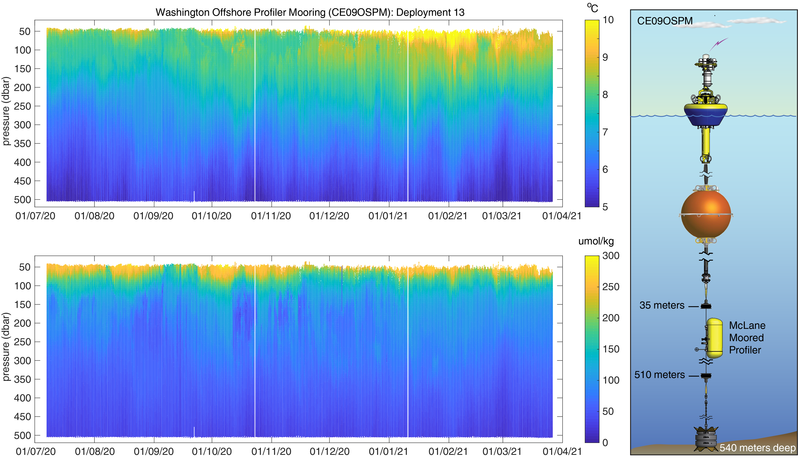
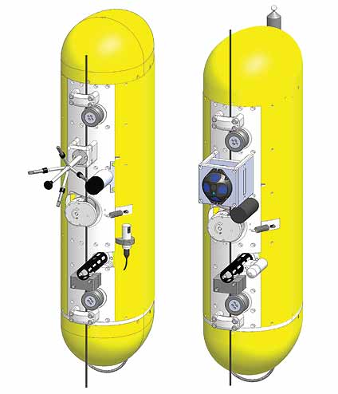

**Figure 1:** Washington Offshore Profiler Mooring (CE09OSPM) temperature (top left) and dissolved oxygen (bottom left) data collected during deployment 13 (July 2020 – March 2021) and processed using _mmp_toolbox_. The right panel shows a diagram of the Washington Offshore Profiler Mooring, including the McLane Moored Profiler that travels along a section of jacketed wire rope between approximately 40 and 500 meters depth.

 
 
Since 2013 the National Science Foundation funded Ocean Observatories Initiative (OOI) has operated and maintained a vast, integrated network of oceanographic platforms and sensors that measure biological, chemical, geological, and physical properties across a range of spatial and temporal scales [@Trowbridge:2019]. This network includes four high-latitude, “global scale” arrays deployed southwest of Chile at 55oS, in the Argentine Basin, central north Pacific at Station Papa, and the Irminger Sea off Greenland. The “coastal scale” Endurance and Pioneer arrays are situated in the northeast Pacific off Oregon and Washington, and off the coast of New England about 140 km south of Martha’s Vineyard, respectively. All coastal and global arrays include moorings, mobile platforms (gliders or autonomous underwater vehicles), and profilers. Wire-Following Profiler (WFP) moorings (Table 1) include at least one McLane® Moored Profiler (MMP) [@Morrison:2000]. Traveling vertically along a section of jacketed wire rope at approximately 25 cm/s, MMPs carry low-power instrumentation that measures physical, chemical, biochemical, and optical ocean properties. To date, the OOI has deployed more than thirty global WFP moorings, about 100 coastal WFP moorings, and collected over 150,000 profiles. While these data are provided to investigators and research communities in near real-time at https://ooinet.oceanobservatories.org, the OOI does not provide post-processed profile data that have, for example, been adjusted for thermal-lag, flow, and sensor time constant effects.
 

| **OOI Mooring Name (Site Code)** | **Site Location** | **Water Depth (meters)**     | **Temporal Coverage**      |
| :---        | :----       | :---          | :---        |
| **Global Arrays**         |
| Argentine Basin Profiler Mooring (GA02HYPM)   | 42.9781°S, 42.4957°W        | 5,200      | Mar 2015 – Jan 2018   |
| Southern Ocean Profiler Mooring (GS02HYPM)      | 54.4693°S, 89.3191°W       | 4,800   | Feb 2015 - Dec 2017      |
| Irminger Sea Profiler Mooring (GI02HYPM)   | 59.9695°N, 39.4886°W        | 2,800      | Sep 2014 - Present   |
| Station Papa Profiler Mooring (GP02HYPM)      | 50.0796°N, 144.806°W       | 4,219   | Jul 2013 - Present      |
|    |         |       |    |
| **Coastal Endurance Array**      |        |    |       |
| Washington Offshore Profiler Mooring (CE09OSPM)   | 46.8517°N, 124.982°W        | 540      | Apr 2014 - Present   |
|       |        |  |       |
| **Coastal Pioneer Array**   |         |       |    |
| Central Profiler Mooring (CP01CNPM)      | 40.1340°N, 70.7708°W       | 130   | Nov 2017 - Present      |
| Central Inshore Profiler Mooring (CP02PMCI)   | 40.2267°N, 70.8782°W        | 127      | Apr 2014 - Present   |
| Central Offshore Profiler Mooring (CP02PMCO)      | 40.0963°N, 70.8789°W       | 148   | Apr 2014 - Present      |
| Upstream Inshore Profiler Mooring (CP02PMUI)   | 40.3649°N, 70.7700°W        | 95      | Nov 2013 - Present   |
| Upstream Offshore Profiler Mooring (CP02PMUO)      | 39.9394°N, 70.7708°W       | 452   | Nov 2013 - Present      |
| Inshore Profiler Mooring (CP03ISPM)   | 40.36202°N, 70.8785°W        | 90      | Nov 2017 - Present   |
| Offshore Profiler Mooring (CP04OSPM)      | 39.9365°N, 70.8802°W       | 453   | Apr 2014 - Present      |

**Table 1:** OOI Wire-Following Profiler names, site codes, mooring locations, water depths, and temporal coverage. 
 
 
 

 
**Figure 2:** Disposition of instruments on the global (left) and coastal (right) variants of the OOI McLane profilers.

### Global OOI MMP Instrumentation
* Seabird SBE52MP CTD (CTDPF-L)
* Aanderaa 4330 oxygen optode (DOSTA-L)
* Seabird\WETLabs FLBBRTD backscatter\fluorometer (FLORD-L)
* Falmouth Scientific profiling acoustic current meter (VEL3D-L)

### Coastal OOI MMP Instrumentation
* Seabird SBE52MP CTD (CTDPF-K)
* Seabird SBE43F oxygen sensor (DOFST-K)
* Seabird\WETLabs eco-Triplet backscatter\fluorometer (FLORT-K)
* Biospherical QSP-2200 PAR sensor (PARAD-K)
* Nortek AD2CP acoustic current meter (custom) (VEL3D-K)

